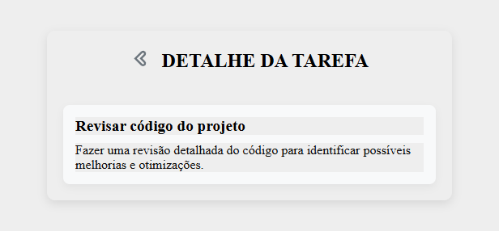

# Gerenciador de Tarefas

Este é um aplicativo de Gerenciamento de Tarefas desenvolvido com React + Vite, utilizando Styled Components para estilização e armazenando tarefas no LocalStorage.

### Tecnologias Utilizadas

- React: Biblioteca para criação da interface do usuário

- Vite: Ferramenta para um desenvolvimento mais rápido

- Styled Components: Estilização dos componentes

- React Icons: Utilização de ícones na interface

- LocalStorage: Armazenamento das tarefas localmente
  
- React-router-dom: roteamento de páginas

### Instalação e Execução

Para rodar o projeto localmente, siga os passos abaixo:

### Clone o repositório:

git clone https://github.com/EwertonRafael/TasksManagerProject

### Entre na pasta do projeto:

`cd nome-do-projeto`

Instale as dependências:

`npm install`

Execute o projeto:

`npm run dev`

Estrutura de Arquivos

### Funcionalidades

----

Adicionar Tarefa: Insira um título e uma descrição para criar uma nova tarefa

Filtrar Tarefas: Visualize apenas as tarefas concluídas, pendentes ou todas

Marcar como Concluída: Clique na tarefa para marcá-la como concluída

Detalhar Tarefa: Clique no símbolo e vá para a segunda página de detalhamento da tarefa

Remover Tarefa: Exclua tarefas indesejadas

Salvar no LocalStorage: As tarefas permanecem salvas após recarregar a página

---

### Interface do Usuário

A interface foi projetada de forma intuitiva, com botões bem posicionados e um design responsivo.

### Melhorias Futuras

Integração com backend para persistência de dados

### Contribuição

Sinta-se à vontade para contribuir com melhorias para este projeto!

---

### Contato

LinkedIn: https://www.linkedin.com/in/ewerton-bertoldo/
